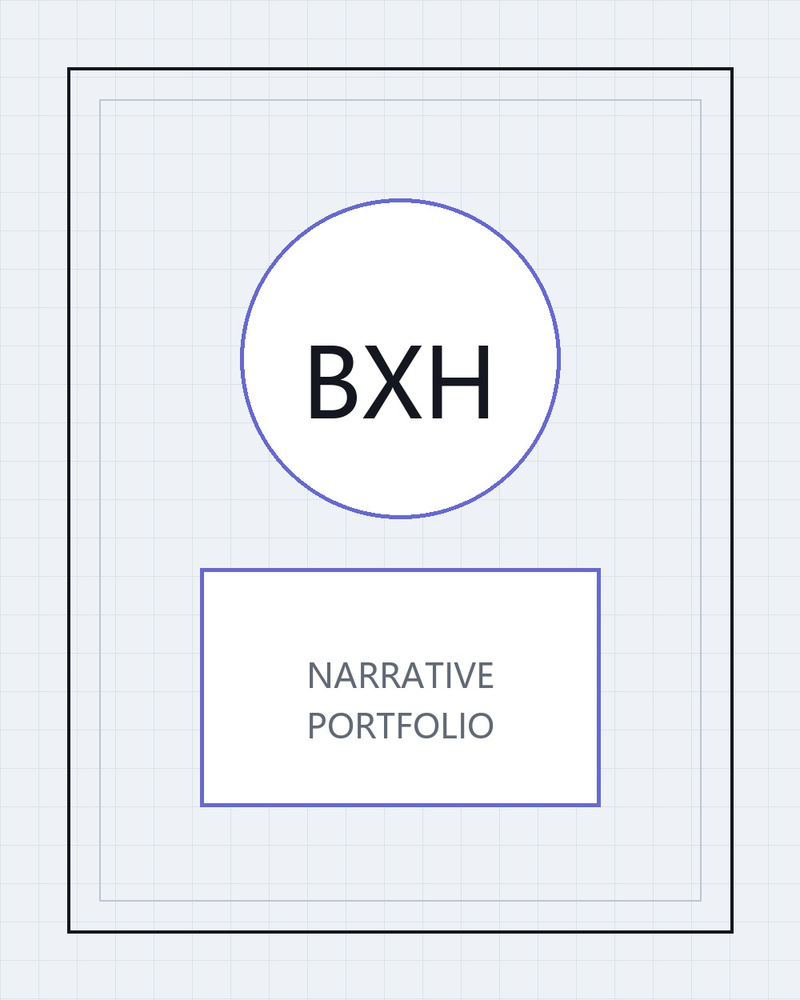

# 鲍薪行个人作品集网页

本项目为纯静态网页，可以直接通过 GitHub Pages 部署。`index.html` 必须位于仓库根目录。

## 项目用途

用于网易 Game Jam 复赛后人才库简历投递，以及游戏剧情策划 / 文案策划 / 叙事设计方向作品展示。

## 本地预览方法

直接双击打开 `index.html`，或在项目根目录启动任意静态服务器后访问本地页面。

## 文件结构说明

```text
portfolio/
├── index.html
├── style.css
├── script.js
├── resume.pdf
├── README.md
└── images/
    ├── avatar.jpg
    ├── echo-title.jpg
    ├── system-ui.jpg
    └── kuzhiuduan-cover.jpg
```

## 如何替换内容

- 替换头像：将新的头像图片命名为 `avatar.jpg`，放入 `images/` 文件夹。
- 替换 Demo 截图：将标题界面截图命名为 `echo-title.jpg`，系统界面截图命名为 `system-ui.jpg`，放入 `images/` 文件夹。
- 替换《苦昼短》封面：将图片命名为 `kuzhiuduan-cover.jpg`，放入 `images/` 文件夹。
- 替换简历 PDF：将正式简历命名为 `resume.pdf`，放在项目根目录。
- 修改联系方式：打开 `index.html`，搜索邮箱、电话或微信并直接替换。
- 修改 Demo 链接：打开 `index.html`，搜索 `cloudstudio.net` 并替换为新的链接。当前链接为 `https://cloudstudio.net/a/36598638549848064?channel=share&sharetype=URL`。

页面内所有资源路径均使用相对路径，例如：

```html
<link rel="stylesheet" href="style.css">
<script src="script.js"></script>

<a href="resume.pdf">下载简历</a>
```

## GitHub Pages 部署方式

1. 登录 GitHub。
2. 新建 Public 仓库：`baoxinhang-portfolio`。
3. 上传项目根目录下所有文件，确保 `index.html` 位于仓库根目录。
4. 进入仓库 `Settings`。
5. 点击 `Pages`。
6. `Source` 选择 `Deploy from a branch`。
7. `Branch` 选择 `main`。
8. `Folder` 选择 `/ root`。
9. 保存。
10. 等待 Pages 构建完成。

## 最终访问链接格式

```text
https://你的GitHub用户名.github.io/baoxinhang-portfolio/
```
